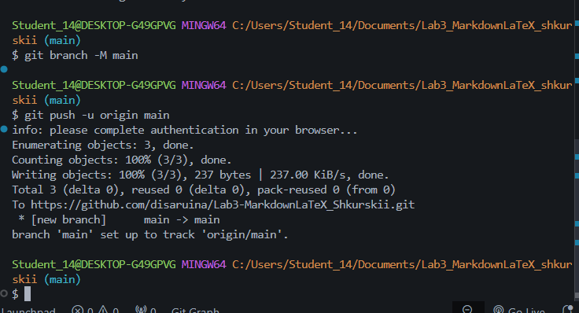

# Лабораторная работа №3. Работа с Markdown и LaTeX

## Описание работы
В этой работе я научился оформлять документацию к проектам с помощью языка разметки Markdown и вставлять математические формулы через LaTeX. Все файлы проекта я храню в локальном репозитории Git и синхронизирую их со своим аккаунтом на GitHub.

---

## Содержание
* [Структура проекта](#структура-проекта)
* [Примеры форматирования текста](#примеры-форматирования-текста)
* [Списки и чекбоксы](#списки-и-чекбоксы)
* [Код и цитаты](#код-и-цитаты)
* [Таблица с командами Git](#таблица-с-командами-git)
* [Формулы LaTeX](#формулы-latex)
* [Картинка и полезные ссылки](#картинка-и-полезные-ссылки)

---

## Структура проекта
Вот как у меня устроены папки в проекте:

* **Lab3_MarkdownLaTeX_Shkurskii/** (корень)
  * `README.md` — этот файл
  * **docs/** — файлы с выполненными заданиями по шагам
    * `headersLab3_Shkurskii.md`
    * `separatorsLab3_Shkurskii.md`
    * `formattingLab3_Shkurskii.md`
    * `listsLab3_Shkurskii.md`
    * `linksImagesLab3_Shkurskii.md`
    * `codeQuotesLab3_Shkurskii.md`
    * `tablesLab3_Shkurskii.md`
    * `advancedMarkdownLab3_Shkurskii.md`
    * `latexLab3_Shkurskii.md`
  * **img/** — скриншоты терминала с коммитами и пушами
    * `gitPushLab3_Shkurskii.png`
    * `commitStructureLab3_Shkurskii.png`
    * `headersCommitLab3_Shkurskii.png`
    * *...и все остальные скриншоты по шагам*
  * **latex/** — папка для формул

---

## Примеры форматирования текста
Здесь я протестировал разные стили текста:
* Вот так пишется **жирный текст**.
* Вот так делается *курсив*.
* А это пример ~~зачеркнутого текста~~.
* Если нужно выделить команду внутри строки, используется `моноширинный шрифт`.

---

## Списки и чекбоксы

### Мой план на сегодня (список задач)
- [x] Создать все файлы по методичке
- [x] Разобраться с таблицами и выравниванием
- [x] Добавить формулы LaTeX
- [ ] Сдать лабораторную преподавателю

### Как я делал коммиты (вложенный список)
1. Сначала проверял статус изменений:
   * Команда: `git status`
2. Потом добавлял файлы в индекс:
   * Команда: `git add .`
3. Делал коммит и отправлял на сервер.

---

## Код и цитаты

### Какая-то умная цитата
> Писать код легко. Писать хороший код вот это сложно.

### Пример кода на C# с подсветкой
```csharp
using System;

class Program
{
    static void Main()
    {
        Console.WriteLine("Лабораторная работа готова к сдаче!");
    }
}
```

---

## Таблица с командами Git

| Функция | Команда Git | Описание |
| :--- | :---: | ---: |
| Создать репозиторий | `git init` | Инициализация Git в папке |
| Посмотреть статус | `git status` | Проверка измененных файлов |
| Отправить на сервер | `git push` | Загрузка коммитов на GitHub |

---

## Формулы LaTeX

### Внутри строки (Inline)
Формула площади круга пишется так: \(S = \pi r^2\).

### Отдельным блоком (Block)
А это формула суммы чисел от 1 до n:
\[\sum_{i=1}^n i = \frac{n(n+1)}{2}\]

---

## Картинка и полезные ссылки

### Мой первый пуш на GitHub
Вот скриншот терминала, который подтверждает, что я успешно связал локальную папку с репозиторием:


### Полезные ссылки для работы
* [Гайд по Markdown](https://markdownguide.org) — тут я смотрел синтаксис.
* [Шпаргалка по LaTeX](https://github.blog) — помогла разобраться с формулами.

---

## Важные заметки

> [!NOTE]
> Все скриншоты я сохранял со своей фамилией.

> [!TIP]
> Чтобы посмотреть, как выглядит этот файл в красивом виде, в VS Code можно нажать `Ctrl + Shift + V`.

> [!WARNING]
> Главное — не забывать писать `cd ..`, когда выходишь из папки `docs` перед коммитом!
